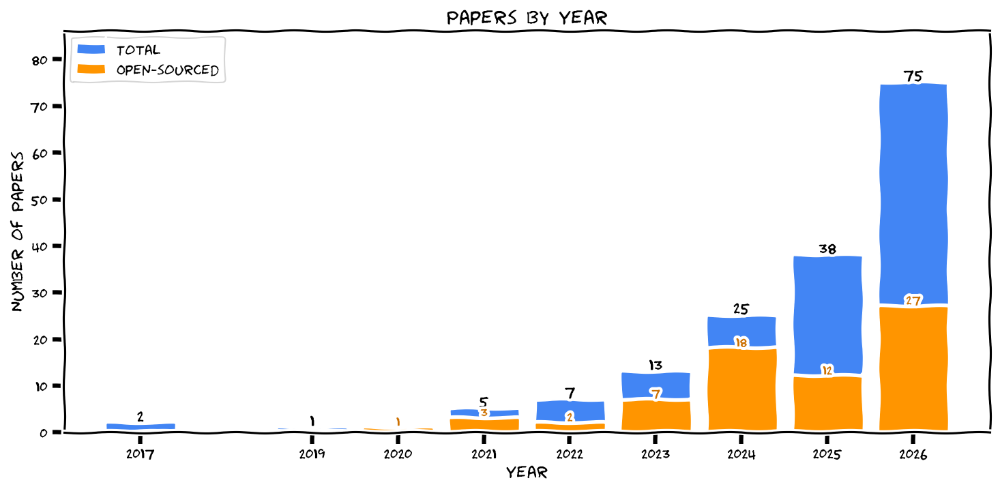
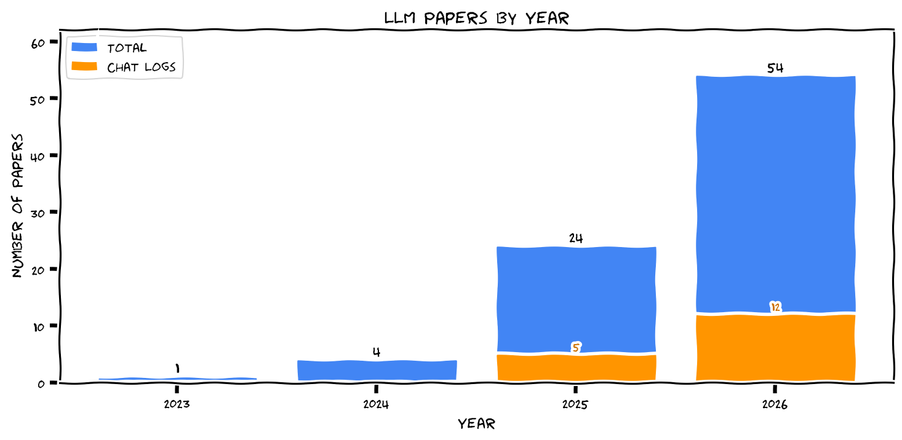

# awesome-ai-for-math

A curated list of 151 awesome papers exploring the use of artificial intelligence / machine learning / deep learning for mathematical discoveries.

See [`CONTRIBUTING.md`](https://github.com/seewoo5/awesome-ai-for-math/blob/main/CONTRIBUTING.md) for contribution.

<!-- Table start -->

| Title | Subject(s) | Venue & Year | Links & Resources |
| :--- | :--- | :--- | :--- |
| **[Undecidability problems for semifree DG algebras](https://arxiv.org/abs/2605.08122)** | Algebra, Geometric Topology, Logic, Symplectic Geometry, LLM | arXiv 2026 | [Chat Logs](https://github.com/google-deepmind/superhuman/tree/main/aletheia/Kirby) |
| **[A Machine Learning Approach That Beats Large Rubik's Cubes](https://arxiv.org/abs/2502.13266)** | Graph Theory, Group Theory, RL | arXiv 2025 | [Code](https://github.com/cayleypy/cayleypy) |
| **[A Systematization of the Wagner Framework: Graph Theory Conjectures and Reinforcement Learning](https://doi.org/10.1007/978-3-031-78977-9_21)** | Graph Theory, RL | Discovery Science 2025 | [Code](https://github.com/CuriosAI/graph_conjectures) [arXiv](https://arxiv.org/abs/2406.12667) |
| **[ABC implies that Ramanujan's tau function misses almost all primes](https://arxiv.org/abs/2603.29970)** | Number Theory, ATP | arXiv 2026 | [Code](https://github.com/AxiomMath/ramanujan-tau-misses-primes) |
| **[Accelerating mathematical research with language models: A case study of an interaction with GPT-5-Pro on a convex analysis problem](https://arxiv.org/abs/2510.26647)** | Analysis, LLM | arXiv 2025 | [Chat Logs](https://arxiv.org/abs/2510.26647) |
| **[Advancing mathematics by guiding human intuition with AI](https://www.nature.com/articles/s41586-021-04086-x)** | Knot Theory, Representation Theory | Nature 2021 | [Code](https://github.com/google-deepmind/mathematics_conjectures) |
| **[Agentic Neurosymbolic Collaboration for Mathematical Discovery: A Case Study in Combinatorial Design](https://arxiv.org/abs/2603.08322)** | Combinatorics, LLM, ATP | arXiv 2026 |  |
| **[AI Co-Mathematician: Accelerating Mathematicians with Agentic AI](https://arxiv.org/abs/2605.06651)** | Group Theory, Representation Theory, LLM | arXiv 2026 |  |
| **[AI Mathematician as a Partner in Advancing Mathematical Discovery -- A Case Study in Homogenization Theory](https://arxiv.org/abs/2510.26380)** | Analysis, LLM | arXiv 2025 | [Chat Logs](https://arxiv.org/abs/2510.26380) |
| **[AI Mathematician: Towards Fully Automated Frontier Mathematical Research](https://arxiv.org/abs/2505.22451)** | Analysis, LLM | arXiv 2025 | [Chat Logs](https://arxiv.org/abs/2505.22451) |
| **[AI-driven research in pure mathematics and theoretical physics](https://www.nature.com/articles/s42254-024-00740-1)** | Survey | Nature Reviews Physics 2025 |  |
| **[Aletheia tackles FirstProof autonomously](https://arxiv.org/abs/2602.21201)** | LLM, Benchmark | arXiv 2026 | [Chat Logs](https://github.com/google-deepmind/superhuman/tree/main/aletheia) |
| **[Algorithm Discovery With LLMs: Evolutionary Search Meets Reinforcement Learning](https://arxiv.org/abs/2504.05108)** | Combinatorics, LLM, RL | arXiv 2025 | [Code](https://github.com/CLAIRE-Labo/EvoTune) |
| **[Algorithm-assisted discovery of an intrinsic order among mathematical constants](https://www.pnas.org/doi/10.1073/pnas.2321440121)** | Number Theory | PNAS 2024 | [Code](https://github.com/RamanujanMachine/) |
| **[Almost all primes are partially regular](https://arxiv.org/abs/2602.05090)** | Number Theory, ATP | arXiv 2026 | [Code](https://github.com/AxiomMath/partial-regularity) |
| **[AlphaEvolve: A coding agent for scientific and algorithmic discovery](https://arxiv.org/abs/2506.13131)** | Matrix Multiplication, Analysis, Combinatorics, Discrete Geometry, LLM | arXiv 2025 | [Unofficial Code](https://github.com/codelion/openevolve) |
| **[AlphaTensor: Discovering faster matrix multiplication algorithms](https://www.nature.com/articles/s41586-022-05172-4)** | Matrix Multiplication, RL | Nature 2022 | [Code](https://github.com/google-deepmind/alphatensor) [Blog](https://deepmind.google/discover/blog/discovering-novel-algorithms-with-alphatensor/) |
| **[An algorithm for Aubert-Zelevinsky duality à la Mœglin-Waldspurger](https://arxiv.org/abs/2509.13231)** | Representation Theory, Neural Network | arXiv 2025 | [Code](https://github.com/ThomasLanard/aubert-zelevinsky-duality) |
| **[An ML approach to resolution of singularities](https://proceedings.mlr.press/v221/berczi23a)** | Algebraic Geometry, RL | TAG-ML 2023 | [Code](https://github.com/honglu2875/hironaka) |
| **[Aristotle: IMO-level Automated Theorem Proving](https://arxiv.org/abs/2510.01346)** | ATP, LLM | arXiv 2025 |  |
| **[Arithmetic volumes of moduli stacks of Shtukas](https://arxiv.org/abs/2601.18557)** | Number Theory, Algebraic Geometry, LLM | arXiv 2026 | [Chat Logs](https://github.com/google-deepmind/superhuman/tree/main/aletheia) |
| **[Artificial intelligence and machine learning generated conjectures with TxGraffiti](https://arxiv.org/abs/2407.02731)** | Graph Theory, Combinatorics | arXiv 2024 | [Code](https://github.com/RandyRDavila/TxGraffiti2) |
| **[Artificial Intelligence and the Structure of Mathematics](https://arxiv.org/abs/2604.06107)** | Survey | arXiv 2026 |  |
| **[Automated Conjecture Resolution with Formal Verification](https://arxiv.org/abs/2604.03789)** | LLM, ATP | arXiv 2026 | [Code (Rethlas)](https://github.com/frenzymath/Rethlas), [Code (Archon)](https://github.com/frenzymath/Archon), [Code (Lean)](https://github.com/frenzymath/Anderson-Conjecture) |
| **[Automated Search for Conjectures on Mathematical Constants using Analysis of Integer Sequences](https://proceedings.mlr.press/v202/razon23a.html)** | Number Theory | ICML 2023 | [Code](https://github.com/RamanujanMachine/) |
| **[Can Transformers Do Enumerative Geometry?](https://proceedings.iclr.cc/paper_files/paper/2025/file/aee2f03ecb2b2c1ea55a43946b651cfd-Paper-Conference.pdf)** | Algebraic Geometry, Interpretability, Transformer | ICLR 2025 | [Code](https://github.com/Baran-phys/DynamicFormer) |
| **[CayleyPy RL: Pathfinding and Reinforcement Learning on Cayley Graphs](https://doi.org/10.4310/atmp.260413005111)** | Graph Theory, Group Theory, RL | Advances in Theoretical and Mathematical Physics 2026 | [Code](https://github.com/cayleypy/cayleypy) [arXiv](https://arxiv.org/abs/2502.18663) |
| **[Constructions in combinatorics via neural networks](https://arxiv.org/abs/2104.14516)** | Graph Theory, RL | arXiv 2021 | [Code](https://github.com/zawagner22/cross-entropy-for-combinatorics) |
| **[Counterexample to majority optimality in NICD with erasures](https://arxiv.org/abs/2510.20013)** | Analysis, LLM | arXiv 2025 |  |
| **[Counting partial Hadamard matrices in the cubic regime](https://arxiv.org/abs/2603.30013)** | Combinatorics, LLM | arXiv 2026 |  |
| **[Data-scientific study of Kronecker coefficients](https://www.tandfonline.com/doi/abs/10.1080/10586458.2025.2490576)** | Representation Theory, PCA | Experimental Mathematics 2023 |  |
| **[Dead ends in square-free digit walks](https://arxiv.org/abs/2602.05095)** | Number Theory, ATP | arXiv 2026 | [Code](https://github.com/AxiomMath/dead-ends) |
| **[Deep Learning for Symbolic Mathematics](https://openreview.net/forum?id=S1eZYeHFDS)** | Differential Equations, Symbolic Computation, Transformer | ICLR 2020 | [Code](https://github.com/facebookresearch/SymbolicMathematics) |
| **[Deep Reinforcement Learning for Fano Hypersurfaces](https://arxiv.org/abs/2603.15437)** | Algebraic Geometry, RL | arXiv 2026 | [Code](https://github.com/marctruter/deep_fano_hypersurface) |
| **[Discovery of Unstable Singularities](https://arxiv.org/abs/2509.14185)** | Differential Equations, PINN | arXiv 2025 |  |
| **[Doubly Saturated Ramsey Graphs: A Case Study in Computer-Assisted Mathematical Discovery](https://arxiv.org/abs/2604.21187)** | Combinatorics, LLM, ATP | arXiv 2026 | |
| **[E6-local systems from cubic threefolds](https://arxiv.org/abs/2604.20970)** | Algebraic Geometry, LLM | arXiv 2026 |  |
| **[Early science acceleration experiments with GPT-5](https://arxiv.org/abs/2511.16072)** | Combinatorics, Optimization Theory, LLM | arXiv 2025 | [Chat Logs](https://arxiv.org/abs/2511.16072) |
| **[Eigenweights for arithmetic Hirzebruch Proportionality](https://arxiv.org/abs/2601.23245)** | Number Theory, Representation Theory, LLM | arXiv 2026 | [Chat Logs](https://github.com/google-deepmind/superhuman/tree/main/aletheia) |
| **[Equality in Fill's spectral gap problem](https://arxiv.org/abs/2604.03937)** | Combinatorics, LLM | arXiv 2026 |  |
| **[EternalMath: A Living Benchmark of Frontier Mathematics that Evolves with Human Discovery](https://arxiv.org/abs/2601.01400)** | Benchmark, LLM | arXiv 2026 |  |
| **[Even with AI, Bijection Discovery is Still Hard: The Opportunities and Challenges of OpenEvolve for Novel Bijection Construction](https://arxiv.org/abs/2511.20987)** | Combinatorics, LLM | arXiv 2025 |  |
| **[Evolving Ranking Functions for Canonical Blow-Ups in Positive Characteristic](https://arxiv.org/abs/2602.06553)** | Algebraic Geometry, LLM | arXiv 2026 |  |
| **[Extremal descendant integrals on moduli spaces of curves: An inequality discovered and proved in collaboration with AI](https://arxiv.org/abs/2512.14575)** | Algebraic Geometry, ATP, LLM | arXiv 2025 | [Code](https://github.com/schmittj/balanced-vectors-blueprint) [Chat Logs](https://arxiv.org/abs/2512.14575) |
| **[Fel's Conjecture on Syzygies of Numerical Semigroups](https://arxiv.org/abs/2602.03716)** | Combinatorics, Algebra, Number Theory, ATP | arXiv 2026 | [Code](https://github.com/AxiomMath/fel-polynomial) |
| **[FIMO: A Challenge Formal Dataset for Automated Theorem Proving](https://arxiv.org/abs/2309.04295)** | Benchmark, ATP | arXiv 2023 |  |
| **[First Proof](https://arxiv.org/abs/2602.05192)** | Benchmark, LLM | arXiv 2026 | [Website](https://1stproof.org/) |
| **[Flow-based Extremal Mathematical Structure Discovery](https://www.arxiv.org/abs/2601.18005)** | Combinatorics, Transformer, Discrete Geometry, RL | arXiv 2026 | [Code](https://github.com/berczig/FlowBoost) |
| **[FlowBoost Reveals Phase Transitions and Spectral Structure in Finite Free Information Inequalities](https://arxiv.org/abs/2604.11922)** | Analysis | arXiv 2026 |  |
| **[Forbidden Sidon subsets of perfect difference sets, featuring a human-assisted proof](https://arxiv.org/abs/2510.19804)** | Combinatorics, Number Theory, LLM, ATP | arXiv 2025 | [Code](https://borisalexeev.com/papers/Erdos707.lean) |
| **[FormalMATH: Benchmarking Formal Mathematical Reasoning of Large Language Models](https://arxiv.org/abs/2505.02735)** | Benchmark, ATP, LLM | arXiv 2025 | [Website](https://spherelab.ai/FormalMATH/) |
| **[From Black Box to Bijection: Interpreting Machine Learning to Build a Zeta Map Algorithm](https://www.arxiv.org/abs/2511.12421)** | Combinatorics, Transformer | arXiv 2025 |  |
| **[From Euler to AI: Unifying Formulas for Mathematical Constants](https://arxiv.org/abs/2502.17533)** | Number Theory, LLM | arXiv 2025 | [Code](https://github.com/RamanujanMachine/euler2ai) |
| **[FrontierMath: A Benchmark for Evaluating Advanced Mathematical Reasoning in AI](https://arxiv.org/abs/2411.04872)** | Benchmark, LLM | arXiv 2024 | [Website](https://epoch.ai/frontiermath) |
| **[GAUSS: Benchmarking Structured Mathematical Skills for Large Language Models](https://arxiv.org/abs/2509.18122)** | Benchmark, LLM | arXiv 2025 | [Website](https://gaussmath.ai/) |
| **[Generating conjectures on fundamental constants with the Ramanujan Machine](https://www.nature.com/articles/s41586-021-03229-4)** | Number Theory | Nature 2021 | [Code](https://github.com/RamanujanMachine/) |
| **[Generative AI for brane configurations and coamoeba](https://journals.aps.org/prd/abstract/10.1103/PhysRevD.111.086013)** | Mathematical Physics, VAE | Physical Review D 2025 |  |
| **[Generative Modeling for Mathematical Discovery](https://doi.org/10.4310/atmp.260412165352)** | Combinatorics, Number Theory, LLM | Advances in Theoretical and Mathematical Physics 2026 | [Code](https://github.com/kitft/funsearch) [arXiv](https://arxiv.org/abs/2503.11061) |
| **[Geometric Generality of Transformer-Based Gröbner Basis Computation](https://doi.org/10.1090/conm/835/16758)** | Algebraic Geometry, Transformer | Artificial Intelligence and Mathematics Research 2026 | [arXiv](https://arxiv.org/abs/2504.12465) |
| **[Global Lyapunov functions: a long-standing open problem in mathematics, with symbolic transformers](https://proceedings.neurips.cc/paper_files/paper/2024/file/aa280e73c4e23e765fde232571116d3b-Paper-Conference.pdf)** | Differential Equations, Transformer | NeurIPS 2024 | [Code](https://github.com/facebookresearch/Lyapunov) |
| **[Gödel Test: Can Large Language Models Solve Easy Conjectures?](https://arxiv.org/abs/2509.18383)** | Discrete Mathematics, LLM | arXiv 2025 |  |
| **[HARDMath: A Benchmark Dataset for Challenging Problems in Applied Mathematics](https://arxiv.org/abs/2410.09988)** | Benchmark, LLM | arXiv 2024 | [Code](https://github.com/sarahmart/HARDMath) |
| **[Hilbert series, machine learning, and applications to physics](https://www.sciencedirect.com/science/article/pii/S0370269322001009)** | Algebraic Geometry, Mathematical Physics, Neural Network | Physics Letters B 2024 | [Code](https://github.com/edhirst/HilbertSeriesML) |
| **[Humanity's Last Exam](https://doi.org/10.1038/s41586-025-09962-4)** | Benchmark, LLM | Nature 2026 | [Website](https://lastexam.ai) [arXiv](https://arxiv.org/abs/2501.14249) |
| **[Illuminating new and known relations between knot invariants](https://doi.org/10.1088/2632-2153/ad95d9)** | Knot Theory, Neural Network | Machine Learning: Science and Technology 2024 | [Code](https://github.com/JessRachel97/Knot_searcher_experiments) [arXiv](https://arxiv.org/abs/2211.01404) |
| **[IMProofBench: Benchmarking AI on Research-Level Mathematical Proof Generation](https://arxiv.org/abs/2509.26076)** | Benchmark, LLM | arXiv 2025 | [Website](https://improofbench.math.ethz.ch/) |
| **[In between myth and reality: AI for math -- a case study in category theory](https://arxiv.org/abs/2504.13360)** | Survey, LLM | arXiv 2025 |  |
| **[Int2Int: a framework for mathematics with transformers](https://doi.org/10.4310/atmp.260412100858)** | Number Theory, Transformer | Advances in Theoretical and Mathematical Physics 2026 | [Code](https://github.com/f-charton/Int2Int) [arXiv](https://arxiv.org/abs/2502.17513) |
| **[Interpretable Machine Learning for Kronecker Coefficients](https://doi.org/10.4310/atmp.260413002916)** | Representation Theory, Neural Network, Symbolic Computation, PCA, Transformer | Advances in Theoretical and Mathematical Physics 2026 | [arXiv](https://arxiv.org/abs/2502.11774) |
| **[Irrationality of rapidly converging series: a problem of Erdős and Graham](https://arxiv.org/abs/2601.21442)** | Number Theory, LLM | arXiv 2026 | [Chat Logs](https://github.com/google-deepmind/superhuman/tree/main/aletheia) |
| **[Lattice-Valued Bottleneck Duality](https://arxiv.org/abs/2410.00315)** | Combinatorics | arXiv 2024 |  |
| **[Learning Euler factors of elliptic curves](https://doi.org/10.4310/atmp.260412180132)** | Number Theory, Transformer | Advances in Theoretical and Mathematical Physics 2026 | [arXiv](https://arxiv.org/abs/2502.10357) |
| **[Learning Fast Monomial Orders for Gröbner Basis Computations](https://arxiv.org/abs/2602.02972)** | Algebraic Geometry, Symbolic Computation, RL | arXiv 2026 | [Code](https://github.com/codesubmission2026/code-submission) |
| **[Learning Formal Mathematics From Intrinsic Motivation](https://doi.org/10.52202/079017-1362)** | ATP, LLM | NeurIPS 2024 | [Code](https://github.com/gpoesia/minimo) [arXiv](https://arxiv.org/abs/2407.00695) |
| **[Learning Fricke signs from Maass form Coefficients](https://doi.org/10.4310/atmp.260412220615)** | Number Theory, LDA | Advances in Theoretical and Mathematical Physics 2026 | [arXiv](https://arxiv.org/abs/2501.02105) |
| **[Learning knot invariants across dimensions](https://doi.org/10.21468/SciPostPhys.14.2.021)** | Knot Theory, Neural Network | SciPost Physics 2023 | [Code](https://github.com/JessRachel97/Knots_across_dims) [arXiv](https://arxiv.org/abs/2112.00016) |
| **[Learning the Inverse Ryu--Takayanagi Formula with Transformers](https://doi.org/10.1007/jhep04(2026)128)** | Mathematical Physics, Transformer | JHEP 2026 | [Code](https://github.com/power817/HEE_3D) [arXiv](https://arxiv.org/abs/2511.06387) |
| **[Learning to compute Gröbner Basis](https://proceedings.neurips.cc/paper_files/paper/2024/hash/3a1de90699eec7d7f42c91d81f94af16-Abstract-Conference.html)** | Algebraic Geometry, Transformer | NeurIPS 2024 | [Code](https://github.com/HiroshiKERA/transformer-groebner) |
| **[Learning Topological Invariance](https://arxiv.org/abs/2504.12390)** | Knot Theory, Neural Network, Transformer | arXiv 2025 |  |
| **[LemmaBench: A Live, Research-Level Benchmark to Evaluate LLM Capabilities in Mathematics](https://arxiv.org/abs/2602.24173)** | Benchmark, LLM | arXiv 2026 |  |
| **[Linear algebra with transformers](https://openreview.net/forum?id=Hp4g7FAXXG)** | Linear Algebra, Symbolic Computation, Transformer | TMLR 2022 | [Code](https://github.com/facebookresearch/LAWT) |
| **[Lower bounds for multivariate independence polynomials and their generalisations](https://www.arxiv.org/abs/2602.02450)** | Combinatorics, LLM | arXiv 2026 | [Chat Logs](https://github.com/google-deepmind/superhuman/tree/main/aletheia) |
| **[Machine Learning Approaches to the Shafarevich-Tate Group of Elliptic Curves](https://www.worldscientific.com/doi/abs/10.1142/S2810939225400015)** | Number Theory, Neural Network, Decision Tree | IJDSMS 2024 | [Code](https://github.com/barinderbanwait/ml_rnt) |
| **[Machine learning assisted exploration for affine Deligne-Lusztig varieties](https://doi.org/10.1007/s42543-024-00086-8)** | Number Theory, Representation Theory | Peking Math J 2024 | [Code](https://github.com/Jinpf314/ML4ADLV/) |
| **[Machine learning BPS spectra and the gap conjecture](https://journals.aps.org/prd/abstract/10.1103/PhysRevD.110.046016)** | Mathematical Physics, PCA | Physical Review D 2024 |  |
| **[Machine learning Calabi-Yau hypersurfaces](https://journals.aps.org/prd/abstract/10.1103/PhysRevD.105.066002)** | Mathematical Physics | Physical Review D 2022 |  |
| **[Machine learning class numbers of real quadratic fields](https://www.worldscientific.com/doi/abs/10.1142/S2810939223500016)** | Number Theory, Interpretability | IJDSMS 2023 |  |
| **[Machine learning detects terminal singularities](https://proceedings.neurips.cc/paper_files/paper/2023/hash/d453490ada2b1991852f053fbd213a6a-Abstract-Conference.html)** | Algebraic Geometry | NeurIPS 2023 | [Code](https://bitbucket.org/fanosearch/ml_terminality) [Talk](https://youtu.be/woCQH-Qmlfo?si=od_rdJs44xM4Jxt3) |
| **[Machine learning for complete intersection Calabi-Yau manifolds: a methodological study](https://journals.aps.org/prd/abstract/10.1103/PhysRevD.103.126014)** | Mathematical Physics | Physical Review D 2021 |  |
| **[Machine learning for modular multiplication](https://arxiv.org/abs/2402.19254)** | Number Theory, Transformer | arXiv 2024 | [Code](https://github.com/meghabyte/mod-math/) |
| **[Machine Learning in the String Landscape](https://link.springer.com/article/10.1007/JHEP09(2017)157)** | Mathematical Physics | JHEP 2017 |  |
| **[Machine learning invariants of arithmetic curves](https://www.sciencedirect.com/science/article/pii/S0747717122000839)** | Number Theory, Logistic Regression, Random Forest | Journal of Symbolic Computation 2023 |  |
| **[Machine Learning Kreuzer–Skarke Calabi–Yau Threefolds](https://doi.org/10.1142/s0217751x25500976)** | Mathematical Physics, Algebraic Geometry, Neural Network | International Journal of Modern Physics A 2025 | [arXiv](https://arxiv.org/abs/2112.09117) |
| **[Machine learning Kronecker coefficients](https://www.worldscientific.com/doi/abs/10.1142/S2810939224400094)** | Representation Theory, CNN, Decision Tree | IJDSMS 2023 |  |
| **[Machine learning line bundle cohomologies of hypersurfaces in toric varieties](https://www.sciencedirect.com/science/article/pii/S0370269319300085)** | Algebraic Geometry | Physics Letters B 2019 |  |
| **[Machine Learning Number Fields](https://link.intlpress.com/JDetail/1806620813564551169)** | Number Theory, Neural Network, Random Forest | MCGD 2022 |  |
| **[Machine learning of Calabi-Yau volumes](https://journals.aps.org/prd/abstract/10.1103/PhysRevD.96.066014)** | Mathematical Physics, CNN, Linear Regression | Physical Review D 2017 |  |
| **[Machine learning Sasakian G2 topology on contact Calabi-Yau 7-manifolds](https://www.sciencedirect.com/science/article/pii/S0370269324000753)** | Mathematical Physics, Neural Network | Physics Letters B 2024 | [Code](https://github.com/TomasSilva/MLcCY7) |
| **[Machine learning the dimension of a Fano variety](https://www.nature.com/articles/s41467-023-41157-1)** | Algebraic Geometry | Nature Communications 2023 | [Code](https://bitbucket.org/fanosearch/mldim/src/master/) |
| **[Machine Learning the vanishing order of rational L-functions](https://doi.org/10.4310/atmp.260412213616)** | Number Theory, LDA, Neural Network | Advances in Theoretical and Mathematical Physics 2026 | [arXiv](https://arxiv.org/abs/2502.10360) |
| **[Machine-learning dessins d'enfants: explorations via modular and Seiberg–Witten curves](https://iopscience.iop.org/article/10.1088/1751-8121/abbc4f/meta?casa_token=cZ63RVRdvnsAAAAA:xnYl-Q3AxTTiLmSVpagIJDplLlUaR5it-7OUQOgn4PFXZ_PzvWQAjkYqL3nAd4XuY1HznxsH7XN4D-ZEkrXNvRYBxc5a)** | Algebraic Geometry, Mathematical Physics | Journal of Physics A 2021 |  |
| **[Machine-learning Sato-Tate conjecture](https://www.sciencedirect.com/science/article/pii/S0747717121000729)** | Number Theory | Journal of Symbolic Computation 2022 |  |
| **[Machines Learn Number Fields, But How? The Case of Galois Groups](https://arxiv.org/abs/2508.06670)** | Number Theory, Logistic Regression, Decision Tree, Interpretability | arXiv 2025 | [Code](https://github.com/seewoo5/ML-NF) |
| **[Mathematical Capabilities of ChatGPT](https://doi.org/10.52202/075280-1205)** | Benchmark, LLM | NeurIPS 2023 | [Code](https://github.com/friederrr/GHOSTS) [arXiv](https://arxiv.org/abs/2301.13867) |
| **[Mathematical discoveries from program search with large language models](https://www.nature.com/articles/s41586-023-06924-6)** | Combinatorics, LLM | Nature 2024 | [Code](https://github.com/google-deepmind/funsearch) |
| **[Mathematical discovery in the age of artificial intelligence](https://www.nature.com/articles/s41567-025-03042-0)** | Survey | Nature Physics 2025 |  |
| **[Mathematical exploration and discovery at scale](https://arxiv.org/abs/2511.02864)** | Combinatorics, Analysis, Number Theory, Discrete Geometry, LLM | arXiv 2025 | [Code](https://github.com/google-deepmind/alphaevolve_repository_of_problems) |
| **[Mathematical methods and human thought in the age of AI](https://arxiv.org/abs/2603.26524)** | Survey | arXiv 2026 |  |
| **[MiniF2F: a cross-system benchmark for formal Olympiad-level mathematics](https://arxiv.org/abs/2109.00110)** | Benchmark, ATP | ICLR 2022 |  |
| **[Murmurations of Elliptic Curves](https://www.tandfonline.com/doi/abs/10.1080/10586458.2024.2382361)** | Number Theory, PCA | Experimental Mathematics 2024 | [Quanta](https://www.quantamagazine.org/elliptic-curve-murmurations-found-with-ai-take-flight-20240305/) |
| **[Neural network approximations for Calabi-Yau metrics](https://link.springer.com/article/10.1007/JHEP08(2022)105)** | Mathematical Physics, Neural Network | JHEP 2022 |  |
| **[New Calabi–Yau manifolds from genetic algorithms](https://www.sciencedirect.com/science/article/pii/S0370269324000625)** | Algebraic Geometry, Mathematical Physics, Genetic Algorithm | Physics Letters B 2024 |  |
| **[Non-uniqueness for a differential equation and a proof by ChatGPT](https://arxiv.org/abs/2605.04810)** | Analysis, LLM | arXiv 2026 | [Chat Logs](https://arxiv.org/abs/2605.04810) |
| **[Olympiad-level formal mathematical reasoning with reinforcement learning](https://www.nature.com/articles/s41586-025-09833-y)** | RL, ATP | Nature 2025 |  |
| **[On (not) learning the Möbius function](https://arxiv.org/abs/2604.23427)** | Number Theory | arXiv 2026 |  |
| **[On the paucity of lattice triangles](https://arxiv.org/abs/2603.23928)** | Geometry, Number Theory, Combinatorics, ATP | arXiv 2026 | [Code](https://github.com/AxiomMath/lattice-triangle) |
| **[On the Quartic Invariant of Odd Degree Binary Forms](https://arxiv.org/abs/2603.24330)** | Algebraic Geometry, Number Theory, LLM, ATP | arXiv 2026 | [Code](https://github.com/ashvin-swaminathan/quartic-invariant) |
| **[Optimal bounds for an Erdős problem on matching integers to distinct multiples](https://arxiv.org/abs/2603.28636)** | Number Theory, Combinatorics, ATP | arXiv 2026 | [Code](https://github.com/Woett/Lean-files/blob/main/ErdosProblem650.lean) |
| **[Parity of k-differentials in genus zero and one](https://arxiv.org/abs/2602.03722)** | Algebraic Geometry, Number Theory, ATP | arXiv 2026 | [Code](https://github.com/AxiomMath/parity-differential) |
| **[PatternBoost: Constructions in Mathematics with a Little Help from AI](https://arxiv.org/abs/2411.00566)** | Discrete Geometry, Combinatorics, Transformer, RL | arXiv 2024 | [Code](https://github.com/zawagner22/transformers_math_experiments) |
| **[Point Convergence of Nesterov's Accelerated Gradient Method: An AI-Assisted Proof](https://arxiv.org/abs/2510.23513)** | Optimization Theory, LLM | arXiv 2025 |  |
| **[Predicting root numbers with neural networks](https://www.worldscientific.com/doi/abs/10.1142/S2810939224400057)** | Number Theory, RNN, CNN | IJDSMS 2024 |  |
| **[Primitive sets and von Mangoldt chains: Erdős Problem #1196 and beyond](https://arxiv.org/abs/2605.00301)** | Number Theory, LLM, ATP | arXiv 2026 | |
| **[Proof or Bluff? Evaluating LLMs on 2025 USA Math Olympiad](https://arxiv.org/abs/2503.21934)** | Benchmark, LLM | arXiv 2025 |  |
| **[ProofNet: Autoformalizing and Formally Proving Undergraduate-Level Mathematics](https://arxiv.org/abs/2302.12433)** | Benchmark, ATP | arXiv 2023 |  |
| **[Putnam-AXIOM: A Functional and Static Benchmark for Measuring Higher Level Mathematical Reasoning in LLMs](https://arxiv.org/abs/2508.08292)** | Benchmark, LLM | arXiv 2025 |  |
| **[PutnamBench: Evaluating Neural Theorem-Provers on the Putnam Mathematical Competition](https://doi.org/10.52202/079017-0368)** | Benchmark, ATP | NeurIPS 2024 | [Code](https://github.com/trishullab/PutnamBench) [Website](https://trishullab.github.io/PutnamBench/) [arXiv](https://arxiv.org/abs/2407.11214) |
| **[R-equivalence on Cubic Surfaces I: Existing Cases with Non-Trivial Universal Equivalence](https://arxiv.org/abs/2603.19215)** | Algebraic Geometry, LLM | arXiv 2026 |  |
| **[Ranks of elliptic curves and deep neural networks](https://link.springer.com/article/10.1007/s40993-023-00462-w)** | Number Theory, CNN | Research in Number Theory 2023 | [Code](https://github.com/domagojvlah/deepellrank) |
| **[RealMath: A Continuous Benchmark for Evaluating Language Models on Research-Level Mathematics](https://arxiv.org/abs/2505.12575)** | Benchmark, LLM | NeurIPS 2025 |  |
| **[Recursive-algebraic solution of the closed string tachyon vacuum equation](https://arxiv.org/abs/2603.29926)** | Mathematical Physics, LLM | arXiv 2026 | [Code](https://github.com/mk2427/csft-tachyon-vacuum) [Chat Logs](https://github.com/mk2427/csft-tachyon-vacuum) |
| **[Reinforced Generation of Combinatorial Structures: Hardness of Approximation](https://arxiv.org/abs/2509.18057)** | Computational Complexity, Combinatorics, LLM | arXiv 2025 |  |
| **[Reinforced Generation of Combinatorial Structures: Ramsey Numbers](https://arxiv.org/abs/2603.09172)** | Combinatorics, LLM | arXiv 2026 | |
| **[Reinforcement Learning the Chromatic Symmetric Function](https://doi.org/10.4310/atmp.260413002529)** | Graph Theory, RL | Advances in Theoretical and Mathematical Physics 2026 | [Code](https://github.com/berczig/PositivityConjectures) [arXiv](https://arxiv.org/abs/2410.19189) |
| **[Resolution of Erdős Problem #728: a writeup of Aristotle's Lean proof](https://arxiv.org/abs/2601.07421)** | Number Theory, LLM, ATP | arXiv 2026 |  |
| **[Rigor with Machine Learning from Field Theory to the Poincaré Conjecture](https://www.nature.com/articles/s42254-024-00709-0)** | Geometry, Mathematical Physics | Nature Reviews Physics 2024 |  |
| **[Searching for ribbons with machine learning](https://iopscience.iop.org/article/10.1088/2632-2153/ade362/meta)** | Geometry, Bayesian Optimization, RL, Neural Network | Machine Learning Science and Technology 2025 | [Code](https://github.com/ruehlef/ribbon) |
| **[Semi-Autonomous Mathematics Discovery with Gemini: A Case Study on the Erdős Problems](https://arxiv.org/abs/2601.22401)** | Combinatorics, Number Theory, LLM | arXiv 2026 | [Chat Logs](https://github.com/google-deepmind/superhuman/tree/main/aletheia) |
| **[Short proofs in combinatorics and number theory](https://arxiv.org/abs/2603.29961)** | Combinatorics, Number Theory, LLM | arXiv 2026 |  |
| **[Short proofs in combinatorics, probability and number theory II](https://arxiv.org/abs/2604.06609)** | Combinatorics, Probability, Number Theory, LLM | arXiv 2026 |  |
| **[Solving a Research Problem in Mathematical Statistics with AI Assistance](https://arxiv.org/abs/2511.18828)** | Statistics, LLM | arXiv 2025 |  |
| **[Strongly Polynomial Time Complexity of Policy Iteration for L-inf Robust MDPs](https://arxiv.org/abs/2601.23229)** | Computational Complexity, LLM | arXiv 2026 | [Chat Logs](https://github.com/google-deepmind/superhuman/tree/main/aletheia) |
| **[Studying number theory with deep learning: a case study with the Möbius and squarefree indicator functions](https://doi.org/10.4310/atmp.260412221625)** | Number Theory, Transformer | Advances in Theoretical and Mathematical Physics 2026 | [Code](https://github.com/davidlowryduda/mobius_case_study) [arXiv](https://arxiv.org/abs/2502.10335) |
| **[The Agentic Researcher: A Practical Guide to AI-Assisted Research in Mathematics and Machine Learning](https://arxiv.org/abs/2603.15914)** | LLM | arXiv 2026 |  |
| **[The Equational Theories Project: Advancing Collaborative Mathematical Research at Scale](https://arxiv.org/abs/2512.07087)** | Algebra, LLM, CNN, ATP | arXiv 2025 | [Code](https://github.com/teorth/equational_theories) |
| **[The motivic class of the space of genus 0 maps to the flag variety](https://arxiv.org/abs/2601.07222)** | Algebraic Geometry, LLM | arXiv 2026 |  |
| **[The Optimist: Towards Fully Automated Graph Theory Research](https://arxiv.org/abs/2411.09158)** | Graph Theory, Optimization Theory | arXiv 2024 | [Code](https://github.com/RandyRDavila/The-Optimist) |
| **[The Simplicity of Hodge Bundle](https://arxiv.org/abs/2603.19052)** | Algebraic Geometry, LLM | arXiv 2026 | [Chat Logs](https://github.com/google-deepmind/superhuman/tree/main/aletheia) |
| **[Towards Autonomous Mathematics Research](https://arxiv.org/abs/2602.10177)** | Survey, LLM | arXiv 2026 |  |
| **[Trees and Graphs with Non Log-concave Dominating Set Sequence via AI Tools](https://arxiv.org/abs/2605.02193)** | Graph Theory, Transformer | arXiv 2026 | [Code](https://github.com/sheilman77/dominating_sets_PatternBoost) |
| **[Unsupervised Discovery of Formulas for Mathematical Constants](https://proceedings.neurips.cc/paper_files/paper/2024/hash/cd8b5de90ebfd6df2b703d2346370cba-Abstract-Conference.html)** | Number Theory | NeurIPS 2024 | [Code](https://github.com/RamanujanMachine/Blind-Delta-Algorithm) |
| **[What makes math problems hard for reinforcement learning: a case study](https://arxiv.org/abs/2408.15332)** | Group Theory, RL, Transformer | arXiv 2024 | [Code](https://github.com/shehper/AC-Solver) |

<!-- Table end -->
